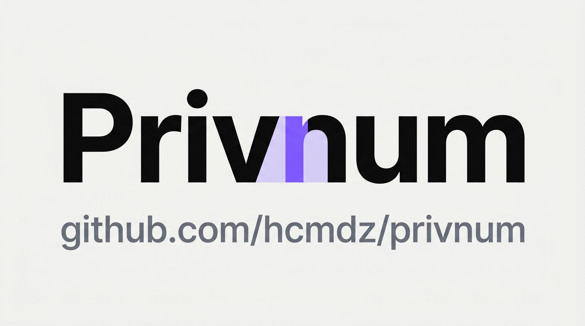

# Privnum
<a id="readme-top"></a>

[](https://github.com/Hcmdz/Privnum)

<div align="center">
<a href="https://github.com/Hcmdz/Privnum">
    
</a>
<br />
<br />
    <a href="https://github.com/Hcmdz/Privnum/issues">Report Bug</a>
    ·
    <a href="https://github.com/Hcmdz/Privnum/issues">Request Feature</a>
    <br />
    <br />
</div>

<div align="center">
   <a href="https://github.com/Hcmdz/Privnum/releases">
      
   </a>
   <a href="https://apps.obtainium.imranr.dev/redirect?r=obtainium://add/https://github.com/Hcmdz/Privnum/">
      
   </a>
</div>

<br />

[](https://www.android.com)
[](https://kotlinlang.org)
[](#)
[](#)
[](https://www.gnu.org/licenses/gpl-3.0)
[](https://github.com/Hcmdz/Privnum/stargazers)
[](https://github.com/Hcmdz/Privnum/network/members)
[](https://developer.android.com/jetpack/compose)

Privnum — private local caller ID — **converted to a 100% Kotlin native
Android app from [Alternate](https://github.com/BioHazard786/Alternate)
(MIT, © BioHazard786)**. Same project converted in place: UI and data
layers rewritten from scratch (the original is React Native + Expo, so no
TypeScript was copied); the existing Kotlin caller module was adapted.

Unknown callers identified from a private on-device database — never
touching the system contacts, WhatsApp, Telegram, or the network: the app
requests **zero network permissions**.

- **Package**: `com.hcmdz.privnum`
- **Version**: 1.1.0 (versionCode 3)
- **Author**: HcmDZ &lt;[HcmDz.Dev@gmail.com]&gt;

<details>
<summary>Table of Contents</summary>
<ol>
<li><a href="#-downloads">Downloads</a></li>
<li><a href="#-screenshots">Screenshots</a></li>
<li><a href="#-key-features">Key Features</a></li>
<li><a href="#️-tech-stack--architecture">Tech Stack &amp; Architecture</a></li>
<li><a href="#-getting-started">Getting Started</a></li>
<li><a href="#-project-structure">Project Structure</a></li>
<li><a href="#-signing">Signing</a></li>
<li><a href="#-apk-size">APK Size</a></li>
<li><a href="#-changelog">Changelog</a></li>
<li><a href="#-legal">Legal</a></li>
<li><a href="#-license">License</a></li>
<li><a href="#-related-docs">Related Docs</a></li>
</ol>
</details>

---

## 📦 Downloads

The latest GitHub release is **v1.1.0** (published September 24, 2026):

- [Download `Privnum-release.apk`](https://github.com/Hcmdz/Privnum/releases/download/v1.1.0/Privnum-release.apk) — 5,011,578 bytes (about 5.0 MB), `arm64-v8a`
- [Download the SHA-256 checksum](https://github.com/Hcmdz/Privnum/releases/download/v1.1.0/Privnum-release.apk.sha256)
- [Install from Obtainium](https://apps.obtainium.imranr.dev/redirect?r=obtainium://add/https://github.com/Hcmdz/Privnum/) to track future GitHub releases.

Install the APK on an Android device or emulator running Android 10 (API 29) or later. Android may ask you to allow installation from the browser or file manager.

```bash
sha256sum -c Privnum-release.apk.sha256
```

<p align="right">(<a href="#readme-top">back to top</a>)</p>

---

## 📸 Screenshots

| Contacts | Editor | Details |
|---|---|---|
| [](screenshots/contacts-light.png?v=2) | [](screenshots/editor-light.png?v=2) | [](screenshots/preview-light.png?v=2) |
| [](screenshots/contacts-dark.png?v=2) | [](screenshots/editor-dark.png?v=2) | [](screenshots/preview-dark.png?v=2) |

<p align="right">(<a href="#readme-top">back to top</a>)</p>

---

## ✨ Key Features

- **Private caller ID.** Incoming/outgoing call popup with name, photo and
  notes resolved from the local database; system call-directory provider
  included.
- **Contacts stay out of the system.** Add, search (FTS prefix, text and
  digits combined), preview, edit, import/export/share VCF (photos
  included) — nothing ever leaves the app database.
- **Several numbers per contact.** Dynamic editor rows with per-row
  country, one primary flag, and duplicate protection across contacts
  (a taken number names its owner instead of merging); caller lookup,
  preview actions, WhatsApp/Telegram rows and VCF backup all cover
  every number.
- **Use the app in your language.** Choose **System** or one of 11 app languages
  in Settings: English, French, Spanish, German, Brazilian Portuguese, Arabic,
  Hindi, Indonesian, Japanese, Korean, or Simplified Chinese. UI labels, country
  names, and dates follow the active locale, including RTL layouts.
- **Lock it down.** Optional passcode (5-attempt lockout), biometrics,
  auto-lock timeouts, instant lock, encrypted storage.
- **Yours to theme.** Dynamic (Material You) colors with toggle, pure-black
  AMOLED mode, light/dark/system.
- **Faces with names.** Optional contact photos (gallery or camera, cropped
  square on-device), shown in list, details and call popup, kept through
  VCF backup.
- **Offline by construction.** No accounts, no analytics, no crash
  reporting, no `INTERNET` permission.

<p align="right">(<a href="#readme-top">back to top</a>)</p>

---

## 🛠️ Tech Stack & Architecture

Multi-module `:app` + `core/*` + `feature/*` with a Jetpack Compose and
Navigation 3 UI, Hilt ViewModels, StateFlow, and a Room repository pattern.
AppCompat per-app locales provide the in-app language selector; there is no
network layer.

### Core Libraries & Tools

| Category | Library | Version |
|---|---|---|
| UI | Jetpack Compose + Material 3 | BOM 2026.09.00 |
| App language | AndroidX AppCompat | 1.8.0 |
| AndroidX Core | core-ktx | 1.18.0 |
| Navigation | Navigation 3 | 1.1.7 |
| Async | Kotlin Coroutines & Flow | 1.11.0 |
| DI | Hilt | 2.60.1 |
| Database | Room (+FTS4) | 2.8.5 |
| Settings | DataStore Preferences | 1.1.3 |
| Phone numbers | libphonenumber | 9.0.40 |
| VCF | ez-vcard | 0.12.2 |
| Images | Coil 3 | 3.6.3 |
| Camera metadata | Exifinterface | 1.4.2 |
| Biometrics | AndroidX Biometric | 1.4.0-alpha07 |
| JSON | kotlinx.serialization | 1.11.0 |
| Build | AGP 9.4.1, Kotlin 2.4.10, KSP 2.3.12, compileSdk 37, minSdk 29 | — |

### Security Features

| Control | Implementation |
|---|---|
| Passcode store | EncryptedSharedPreferences (AES256-GCM, Keystore-backed master key); the PIN is derived with PBKDF2-HMAC-SHA256 and compared in constant time |
| Contact photos at rest | AES-GCM per file under a non-exportable platform keystore key; photos written before encryption stay readable and are re-encrypted on their next write |
| Backup and transfer | `allowBackup="false"` plus `dataExtractionRules` excluding every domain, so nothing leaves through a cloud backup or a device-to-device transfer |
| Screenshot protection | `FLAG_SECURE` on every screen that shows contact data, search results or the passcode |
| Log hygiene | Release builds strip `Log.d/v/e/w` (R8 + shrink) |
| No network | Zero network permissions declared or requested |

### Permissions

- `READ_PHONE_STATE` — read incoming/outgoing call state for the popup
- `READ_CALL_LOG` — call-state resolution where the system requires it
- `SYSTEM_ALERT_WINDOW` — draw the caller popup over other apps (opt-in, with rationale)
- `POST_NOTIFICATIONS` — call-related notifications (Android 13+)
- `DISABLE_KEYGUARD` — show the popup over the lock screen
- `CAMERA` — not requested; photos come from the gallery picker or capture intent (no permission needed)

Entry points: `MainActivity` (launcher), `CallReceiver` (phone-state broadcasts), `CallDetectScreeningService` (role-gated, `BIND_SCREENING_SERVICE`), `CallDirectoryProvider` (external lookup guarded by `READ_CONTACTS`), `FileProvider` (VCF and photo sharing, authority `com.hcmdz.privnum.fileprovider`).

### CI & Quality

- `.github/workflows/ci.yml` — `ci` job runs `testDebugUnitTest`, `lintDebug`, `assembleDebug`, then `detekt`. A second `secret-gate` job scans the full history for secrets and fails when a path listed in `.github/sensitive-filenames.txt` is tracked.
- `.github/workflows/codeql.yml` — static analysis on every push and pull request, plus a weekly schedule.
- `.github/dependabot.yml` — weekly grouped updates for Gradle dependencies and GitHub Actions.
- Static analysis: the root `detekt` task (`config/detekt/detekt.yml` + `config/detekt/baseline.xml`) reports findings without failing the build.
- Local gate: `./gradlew testDebugUnitTest lintDebug`.
- Device tests: `./gradlew :core:data:connectedDebugAndroidTest` with an emulator or device attached.

<p align="right">(<a href="#readme-top">back to top</a>)</p>

---

## 🚀 Getting Started

### Prerequisites

- **Android Studio** (Ladybug or newer) — IDE ([doc](https://developer.android.com/studio))
- **JDK 17** — Gradle toolchain ([doc](https://docs.gradle.org/current/userguide/build_java_projects.html))
- **Android SDK** with compileSdk 37; emulator or device on API 29+

### Installation

```bash
git clone https://github.com/Hcmdz/Privnum.git
cd Privnum
export JAVA_HOME=<jdk-17> ANDROID_HOME=<sdk>
./gradlew assembleDebug     # app/build/outputs/apk/debug/Privnum-debug.apk
./gradlew installDebug      # run on device
```

### Testing

```bash
./gradlew testDebugUnitTest   # VCF round-trip, phone utils, FTS, screening, countries
./gradlew lintDebug
```

DAO/device tests run on demand against the emulator (caller overlay
verified end to end with `adb emu gsm call`).

<p align="right">(<a href="#readme-top">back to top</a>)</p>

---

## 📁 Project Structure

```
app/src/main/java/com/hcmdz/privnum/
├── MainActivity.kt              # Entry point, lock gate, theme
├── AppNav.kt                    # Nav3 graph (contacts/search/editor/preview/settings/lock)
├── PrivnumApplication.kt        # Hilt application
├── res/xml/file_paths.xml       # FileProvider paths (VCF/photo sharing)
├── res/values-*/                # Localized UI resources
└── res/xml/locale_config.xml    # Supported app locales
core/caller/                    # Screening service, receiver, directory provider, overlay UI
core/data/                      # Room (contacts + phone_numbers + FTS4,
│   │                           # exportSchema=true, v1→v2 migration), repository,
│   │                           # DataStore settings, encrypted passcode, VCF, photo store
│   ├── db/                      # Entities, DAO, database
│   └── schemas/                 # Exported Room JSON schemas
core/ui/                        # Material 3 theme + shared ContactAvatar
feature/contacts|editor|        # MVI screens + Hilt ViewModels + unit tests
  search|settings|lock|preview/
gradle/libs.versions.toml       # Single source for dependency versions
screenshots/                    # Light- and dark-mode captures used above
docs/privacy|terms/             # Published Privacy Policy and Terms of Service
config/detekt/                  # Static-analysis configuration
```

<p align="right">(<a href="#readme-top">back to top</a>)</p>

---

## 🔏 Signing

Release signing reads the shared `RELEASE_*` keys from
`~/.gradle/gradle.properties` (same identity as the author's other
apps, one rotation point).

The signature is applied only when those properties are present. Without
them `assembleRelease` still succeeds and writes an **unsigned** APK, which
Android refuses to install - the failure shows up on the device, not in the
build, so verify the artifact before publishing it. Debug builds are
unaffected: they are always signed with the SDK's own debug key.

```properties
RELEASE_STORE_FILE=/path/to/your/release.keystore
RELEASE_KEY_ALIAS=ALIAS
RELEASE_STORE_PASSWORD=YOUR_KEYSTORE_PASSWORD
RELEASE_KEY_PASSWORD=YOUR_KEY_PASSWORD
```

```bash
./gradlew assembleRelease   # app/build/outputs/apk/release/Privnum-release.apk
apksigner verify --print-certs app/build/outputs/apk/release/Privnum-release.apk
```

<p align="right">(<a href="#readme-top">back to top</a>)</p>

---

## 📏 APK Size

Current release build (`versionCode 3`, `arm64-v8a` only, R8 + resource
shrinking): **4,774,818 bytes** (4.77 MB).

| Component | Size |
|---|---|
| Code (dex) | 3.87 MB |
| Resources | 0.24 MB |
| Everything else | 0.46 MB |

The published [v1.1.0](https://github.com/Hcmdz/Privnum/releases/tag/v1.1.0)
asset is 5,011,578 bytes (5.01 MB).

<p align="right">(<a href="#readme-top">back to top</a>)</p>

---

## 📝 Changelog

### Unreleased

- Added an in-app language selector with System plus 11 supported app languages.
- Localized UI resources, country names, and dates, including RTL layouts for Arabic.

### v1.1.0
- Multiple phone numbers per contact (Room v1→v2 migration, primary flag, per-number actions, multi-TEL VCF)

### v1.0.0
- Native conversion: contacts, search, editor, details, settings, lock, VCF backup, caller ID
- Build: AGP 9.4.1, Kotlin 2.4.10

<p align="right">(<a href="#readme-top">back to top</a>)</p>

---

## ⚖️ Legal

- [Terms of Service](docs/terms/)
- [Privacy Policy](docs/privacy/)

<p align="right">(<a href="#readme-top">back to top</a>)</p>

---

## 📄 License

Copyright (c) 2026 Hcmdz. This project is licensed under the
[GNU General Public License v3.0 or later](https://www.gnu.org/licenses/gpl-3.0) —
see the [LICENSE](LICENSE) file for details.

<p align="right">(<a href="#readme-top">back to top</a>)</p>

---

## 🔗 Related Docs

- [Contributing](CONTRIBUTING.md) · [Code of Conduct](CODE_OF_CONDUCT.md) · [Third-Party Components](THIRD_PARTY.md) · [Security](SECURITY.md)

## 📬 Contact

Hcmdz — [@Hcmdz](https://github.com/Hcmdz)

Project link: [https://github.com/Hcmdz/Privnum](https://github.com/Hcmdz/Privnum)

## 🙏 Acknowledgments

- [Alternate](https://github.com/BioHazard786/Alternate) by BioHazard786 — the converted project (caller native module adapted from its Kotlin code)
- [dmkvsk](https://github.com/dmkvsk/react-native-detect-caller-id) — native-module inspiration (via upstream)
- [SimpleNexus](https://github.com/SimpleNexus/simplecallerid) — call-directory implementation (via upstream)
