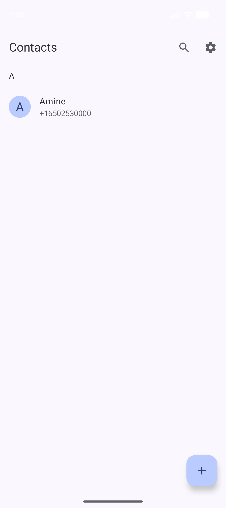
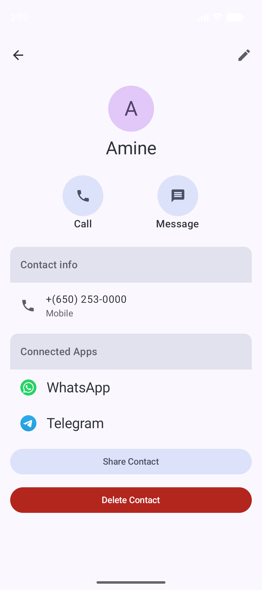

# Privnum-native
<a id="readme-top"></a>

[](https://www.android.com)
[](https://kotlinlang.org)
[](#)
[](#)
[](LICENSE)

Privnum — private local caller ID — **converted to a 100% Kotlin native
Android app from [Alternate](https://github.com/BioHazard786/Alternate)
(MIT, © BioHazard786)**. Same project converted in place: UI and data
layers rewritten from scratch (the original is React Native + Expo, so no
TypeScript was copied); the existing Kotlin caller module was adapted.

Unknown callers identified from a private on-device database — never
touching the system contacts, WhatsApp, Telegram, or the network: the app
requests **zero network permissions**.

- **Package**: `com.hcmdz.privnum`
- **Version**: 1.0.0 (versionCode 1)

<details>
<summary>Table of Contents</summary>
<ol>
<li><a href="#-screenshots">Screenshots</a></li>
<li><a href="#-key-features">Key Features</a></li>
<li><a href="#️-tech-stack--architecture">Tech Stack &amp; Architecture</a></li>
<li><a href="#-getting-started">Getting Started</a></li>
<li><a href="#-project-structure">Project Structure</a></li>
<li><a href="#-signing">Signing</a></li>
<li><a href="#-apk-size">APK Size</a></li>
<li><a href="#-changelog">Changelog</a></li>
<li><a href="#-license">License</a></li>
<li><a href="#-related-docs">Related Docs</a></li>
</ol>
</details>

---

## 📸 Screenshots

| Contacts | Editor | Details |
|---|---|---|
| [](screenshots/contacts-light.png) | [](screenshots/editor-light.png) | [](screenshots/preview-light.png) |

<p align="right">(<a href="#readme-top">back to top</a>)</p>

---

## ✨ Key Features

- **Private caller ID.** Incoming/outgoing call popup with name, photo and
  notes resolved from the local database; system call-directory provider
  included.
- **Contacts stay out of the system.** Add, search (FTS prefix), preview,
  edit, import/export/share VCF (photos included) — nothing ever leaves
  the app database.
- **Lock it down.** Optional passcode (5-attempt lockout), biometrics,
  auto-lock timeouts, instant lock, encrypted storage.
- **Offline by construction.** No accounts, no analytics, no crash
  reporting, no `INTERNET` permission.

<p align="right">(<a href="#readme-top">back to top</a>)</p>

---

## 🛠️ Tech Stack & Architecture

Multi-module `:app` + `core/*` + `feature/*`, Nav3 graph, MVI screens with
Hilt ViewModels and StateFlow; Room repository pattern; no network layer.

### Core Libraries & Tools

| Category | Library | Version |
|---|---|---|
| UI | Jetpack Compose + Material 3 | BOM 2026.09.00 |
| Async | Kotlin Coroutines & Flow | 1.11.0 |
| DI | Hilt | 2.60.1 |
| Database | Room (+FTS4) | 2.8.5 |
| Settings | DataStore Preferences | 1.1.3 |
| Phone numbers | libphonenumber | 9.0.40 |
| VCF | ez-vcard | 0.12.2 |
| Images | Coil 3 | 3.3.0 |
| Build | AGP 9.4.1, Kotlin 2.4.10, KSP 2.3.12, compileSdk 37, minSdk 29 | — |

### Security Features

| Control | Implementation |
|---|---|
| Encryption at rest | EncryptedSharedPreferences (AES256-GCM, Keystore-backed master key) for passcode store |
| Backup disabled | `allowBackup="false"` |
| Log hygiene | Release builds strip `Log.d/v` (R8 + shrink) |
| No network | Zero network permissions declared or requested |

### Permissions

- `READ_PHONE_STATE` — read incoming/outgoing call state for the popup
- `READ_CALL_LOG` — call-state resolution where the system requires it
- `SYSTEM_ALERT_WINDOW` — draw the caller popup over other apps (opt-in, with rationale)
- `POST_NOTIFICATIONS` — call-related notifications (Android 13+)
- `DISABLE_KEYGUARD` — show the popup over the lock screen
- `CAMERA` — not requested; photos come from the gallery picker or capture intent (no permission needed)

Entry points: `MainActivity` (launcher), `CallReceiver` (phone-state broadcasts), `CallDetectScreeningService` (role-gated, `BIND_SCREENING_SERVICE`), `CallDirectoryProvider` (`READ_CONTACTS`-guarded lookup).

### CI & Quality

- GitHub Actions: `.github/workflows/ci.yml` (unit tests + lint + debug build), Dependabot (gradle + actions, weekly)
- Gate: `./gradlew testDebugUnitTest lintDebug`

<p align="right">(<a href="#readme-top">back to top</a>)</p>

---

## 🚀 Getting Started

### Prerequisites

- **Android Studio** (Ladybug or newer) — IDE ([doc](https://developer.android.com/studio))
- **JDK 17** — Gradle toolchain ([doc](https://docs.gradle.org/current/userguide/build_java_projects.html))
- **Android SDK** with compileSdk 37; emulator or device on API 29+

### Installation

```bash
git clone https://github.com/Hcmdz/Privnum-native.git
cd Privnum-native
export JAVA_HOME=<jdk-17> ANDROID_HOME=<sdk>
./gradlew assembleDebug     # app/build/outputs/apk/debug/Privnum-debug.apk
./gradlew installDebug      # run on device
```

### Testing

```bash
./gradlew testDebugUnitTest   # VCF round-trip, phone utils, FTS, screening, countries
./gradlew lintDebug
```

DAO/device tests run on demand against the emulator (caller overlay
verified end to end with `adb emu gsm call`).

<p align="right">(<a href="#readme-top">back to top</a>)</p>

---

## 📁 Project Structure

```
app/src/main/java/com/hcmdz/privnum/
├── MainActivity.kt              # Entry point, lock gate, theme
├── AppNav.kt                    # Nav3 graph (contacts/search/editor/preview/settings/lock)
├── PrivnumApplication.kt        # Hilt application
└── res/xml/file_paths.xml       # FileProvider paths (VCF/photo sharing)
core/caller/                    # Screening service, receiver, directory provider, overlay UI
core/data/                      # Room (contacts + FTS4, exportSchema=true), repository,
│   │                           # DataStore settings, encrypted passcode, VCF, photo store
│   └── db/                      # Entities, DAO, database + schemas/
core/ui/                        # Material 3 theme + shared ContactAvatar
feature/contacts|editor|        # MVI screens + Hilt ViewModels + unit tests
  search|settings|lock|preview/
gradle/libs.versions.toml       # Single source for dependency versions
.github/workflows/ci.yml        # test + lint + debug build
screenshots/                    # Light-mode captures used above
```

<p align="right">(<a href="#readme-top">back to top</a>)</p>

---

## 🔏 Signing

Release signing reads the shared `RELEASE_*` keys from
`~/.gradle/gradle.properties` (same identity as the author's other
apps, one rotation point). Unsigned/misconfigured builds fail loudly
at `packageRelease` — never silently.

```properties
RELEASE_STORE_FILE=/path/to/your/release.keystore
RELEASE_KEY_ALIAS=ALIAS
RELEASE_STORE_[REDACTED:password]
RELEASE_KEY_[REDACTED:password]
```

```bash
./gradlew assembleRelease   # app/build/outputs/apk/release/Privnum-release.apk
apksigner verify --print-certs app/build/outputs/apk/release/Privnum-release.apk
```

<p align="right">(<a href="#readme-top">back to top</a>)</p>

---

## 📏 APK Size

Current release APK: **~4.1 MB** (universal, single APK, R8 + shrink enabled).

<p align="right">(<a href="#readme-top">back to top</a>)</p>

---

## 📝 Changelog

### v1.0.0
- Native conversion: contacts, search, editor, details, settings, lock, VCF backup, caller ID
- Build: AGP 9.4.1, Kotlin 2.4.10

<p align="right">(<a href="#readme-top">back to top</a>)</p>

---

## 📄 License

This project is licensed under the [MIT](LICENSE) — see the [LICENSE](LICENSE) file for details.

<p align="right">(<a href="#readme-top">back to top</a>)</p>

---

## 🔗 Related Docs

- [Contributing](CONTRIBUTING.md) · [Third-Party Components](THIRD_PARTY.md) · [Security](SECURITY.md)

## 📬 Contact

Hcmdz — [@Hcmdz](https://github.com/Hcmdz)

Project link: [https://github.com/Hcmdz/Privnum-native](https://github.com/Hcmdz/Privnum-native)

## 🙏 Acknowledgments

- [Alternate](https://github.com/BioHazard786/Alternate) by BioHazard786 — the converted project (caller native module adapted from its Kotlin code)
- [dmkvsk](https://github.com/dmkvsk/react-native-detect-caller-id) — native-module inspiration (via upstream)
- [SimpleNexus](https://github.com/SimpleNexus/simplecallerid) — call-directory implementation (via upstream)
